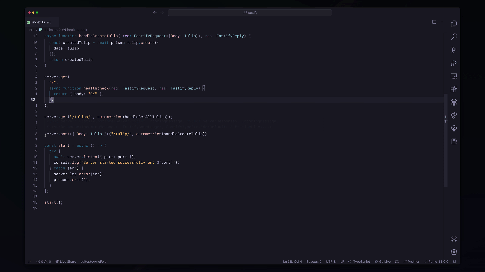
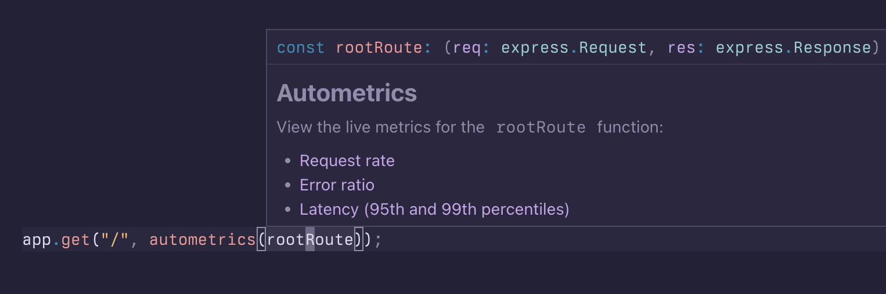

<div align="center">
<h1>Autometrics</h1>
<a href="https://github.com/autometrics-dev/autometrics-ts/actions?query=branch%3Amain"></a>
<a href="https://opensource.org/licenses/MIT" rel="nofollow"></a>
<a href="https://discord.gg/MJr7pYzZQ4" rel="nofollow"></a>
</div>

> A TypeScript port of the Rust
> [autometrics-rs](https://github.com/fiberplane/autometrics-rs) library

**A library that makes it easy to understand the error rate, response time, and
production usage of any function in your code.** Jump straight from your IDE to
live Prometheus charts for each HTTP/RPC handler, database method, or other
piece of application logic.

Autometrics for TypeScript provides a wrapper function and a decorator that can
create Prometheus or OpenTelemetry metrics for your functions and class methods
throughout your code base, as well as a language service plugin that will write
corresponding Prometheus queries for you.

See [Why Autometrics?](https://github.com/autometrics-dev#why-autometrics) for
more details on the ideas behind autometrics



## Features

- ✨ `autometrics` wrapper instruments any function or class method to track the
  most useful metrics
- 🌳 Works in NodeJS and browser environments (Deno and serverless support coming soon)
- 💡 Writes Prometheus queries so you can understand the data generated without
  knowing PromQL
- 🔗 Injects links to live Prometheus charts directly into each function's doc
  comments
- 📊 (Coming Soon!) Grafana dashboard showing the performance of all
  instrumented functions
- 🚨 Generates Prometheus alerting rules using SLO best practices
  from simple annotations in your code
- ⚡ Minimal runtime overhead

## How it works

The Autometrics library:
- Automatically instruments any wrapped function with OpenTelemetry metrics
- Uses a Prometheus Exporter to write metrics to a `/metrics` endpoint (by
	default on port `:9464`) or pushes it to a specified gateway (if used in
	browser)
- Uses the TypeScript plugin to automatically write useful Prometheus queries
	for instrumented functions and show them in the doc comments.

## Quickstart

```shell
npm install --save autometrics 
npm install --save-dev @autometrics/typescript-plugin
```

Enable TypeScript plugin by adding it to `tsconfig.json`:

```json
{
  "compilerOptions": {
   "plugins": [
    {
     "name": "@autometrics/typescript-plugin",
     "prometheusUrl": ""
    }
   ]
  }
}
```

Use the library in your code:

```typescript
import { autometrics } from "autometrics"
```

> Note: for VSCode users: make sure you select your VSCode TypeScript server
> to local to the project (where you have TypeScript installed in your
> `devDependencies`).
>
> In `.vscode/settings.json` set:
>
> ```json
> {
>   "typescript.tsdk": "node_modules/typescript/lib"
> }
> ```

### For projects already using OpenTelemetry metrics

The default `autometrics` package bundles `@opentelemetry/sdk-metrics` and
`@opentelemetry/exporter-prometheus` dependencies. If you are already using
these in your codebase or want to use other custom metrics, use the following
installation option.

Install the wrappers, the language service plugin:

```shell
npm install --save @autometrics/autometrics
npm install --save-dev @autometrics/typescript-plugin
```

Add the language service plugin to the `tsconfig.json` file:

```json
{
 "compilerOptions": {
 "plugins": [
   {
    "name": "@autometrics/typescript-plugin",
    "prometheusUrl": ""
   }
  ]
 }
}
```

## Alerts / SLOs

Autometrics makes it easy to add Prometheus alerts using Service-Level Objectives (SLOs) to a function or group of functions.

This works using pre-defined [Prometheus alerting rules](./autometrics.rules.yml) (read more about alerting rules in general [here](https://prometheus.io/docs/prometheus/latest/configuration/alerting_rules/)).
By default, most of the recording rules are dormaint. They are enabled by specific metric labels that can be automatically attached by autometrics.

To use autometrics SLOs and alerts, create one or multiple [`Objective`s](https://github.com/autometrics-dev/autometrics-ts/blob/main/packages/autometrics-lib/src/objectives.ts) based on the function(s) success rate and/or latency, as shown below. The `Objective` can be passed as an argument to the `autometrics` wrapper function to include the given function in that objective.

```ts
import { autometrics, Objective, ObjectiveLatency, ObjectivePercentile } from "@autometrics/autometrics";

const API_SLO: Objective = {
 name: 'api',
 successRate: ObjectivePercentile.P99_9,
 latency: [ObjectiveLatency.Ms250, ObjectivePercentile.P99],
};

const apiHandlerFn = autometrics({ objective: API_SLO }, function apiHandler(
 // ...
));
```

## Using wrappers and decorators in NodeJS

Use Autometrics wrappers to instrument the functions you want to track (e.g.:
request handlers or database calls).

### Adding function wrappers

Wrappers are simple functions that wrap the original function declaration
instrumenting it with metrics and allowing the language service plugin to add
additional information to the type docs.

Use function wrappers to wrap your request handlers, database calls, or other
pieces of important business logic that you want to measure.

> **Note**: wrapped functions must be named. Autometrics will throw an error if
> it can't access the name of the function.

Example:

```typescript
import { autometrics, Objective } from "autometrics";

const createUser = autometrics(async function createUser(payload: User) {
  // ...
})

const user = createUser()
```

> Note: if you're using the `@autometrics/autometrics` package instead of
> `autometrics`, import the helper functions from there:
> ```typescript
> import { autometrics } from "@autometrics/autometrics"
> ```


### Adding decorators for class methods

For class methods where a decorator is added, they are wrapped in additional
code that instruments it with OpenTelemetry metrics.

Here's a snippet from the example code:

```typescript
import { Controller, Get } from '@nestjs/common';
import { AppService } from './app.service';
import { autometricsDecorator as autometrics } from "autometrics";

@Controller()
export class AppController {
  constructor(private readonly appService: AppService) {}

  @Get()
  @autometrics
  getHello(): string {
    return this.appService.getHello();
  }
}
```

### Getting the generated queries

Hover over any Autometrics-instrumented function or class to see the generated
queries. You can click on any of the links to go directly to the Prometheus
chart for that function.



## Using wrappers in the browser

### Set up the push gateway

In order for Prometheus to succesfully get your client-side web app metrics, you
will need to push them to an aggregating push gateway [like this
one](https://github.com/zapier/prom-aggregation-gateway).

Use `init` function to configure the gateway URL autometrics should push the
data to. You can also set the push interval with the `pushInterval` property
(default is every 5000 miliseconds);

```typescript
init({ pushGateway: "<link_to_gateway>" })
```

### Use Autometrics wrapper with options

Same wrapper functions can be used in browser environments. Note: bundlers might
impact the library as function names (necessary for the library to work) are
often stripped. To circumvent that, wrappers can take in an options object as
the first item that explicitly assigns the function and module names.

```typescript
const myFunction = autometrics(
  {
    functionName: "myFunction",
    moduleName: "Module",
  },
  async () => {
    // ... myFunction body
  },
);
```

## Configuration

### Set your own Exporter

By default, autometrics exports your metrics with OpenTelemetry's Prometheus
Exporter on port `:9464`, endpoint `/metrics`. You can configure it as you wish,
however, by using the `init` function as well.

Example if you want to set an exporter to port 7777:

```javascript
import { autometrics, init } from "@autometrics/autometrics";
import { PrometheusExporter } from "@opentelemetry/exporter-prometheus";

const exporter = new PrometheusExporter({ port: 7777 });
setMetricsExporter(exporter);
```

### Language service plugin

Language service plugin can be configured in the `tsconfig.json` file.

#### Options

| key             | description                                                     |
| --------------- | --------------------------------------------------------------- |
| `name`          | always `@autometrics/typescript-plugin`                         |
| `prometheusUrl` | sets the base URL for PromQL queries. Default: `localhost:9090` |
